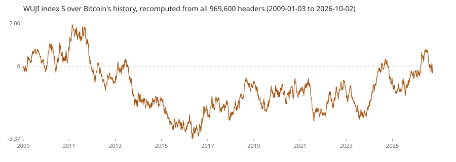

# WUJI over Bitcoin's whole history (2009–2026)

Computed 2026-10-02 by `scripts/history_study.py` from all **969,600** Bitcoin mainnet headers (height 0 to
969,599, genesis `000000000019d6…e26f`, every header linked to its parent) and Binance daily closes for
BTC/USDT, ETH/USDT (from 2017-08-17) and PAX Gold/USDT (from 2020-08-28). Full results:
`docs/data/history-study.json`. Anyone can rerun it from the same inputs.

The index never needed a launch to have a history: it is a function of Bitcoin headers, so its full path
from the genesis block exists already. This study treats that path as 17.75 years of observations.

**Check against the contracts first.** Recomputed increments over heights 798,336–804,395 sum to exactly
`U = 6888`, the value the Solidity, JavaScript and Rust implementations reproduce in the repository's fixture
tests. The numbers below come from the same rule the contracts apply.

## 1. Each block's increment matches its theoretical distribution

The increment is `byteSum(sha256(blockhash)) − 4080`. If the 32 bytes are uniform and independent, it has
mean 0, standard deviation √(32·(256²−1)/12) = 418.04, and an exactly computable distribution.

| quantity | observed | theory |
|---|---:|---:|
| mean | −0.024 (z = −0.06) | 0 |
| standard deviation | 417.94 | 418.04 |
| variance ratio | 0.9995 (z = −0.36) | 1 |
| skew | −0.002 | 0 |
| excess kurtosis | −0.039 | −0.0375 |
| min / max | −1,918 / +2,030 | ±4,080 possible |
| χ² against the exact distribution, 167 bins | 158.1, p = 0.66 | — |

**Why the extra hash matters.** Summing the bytes of the block hash itself gives a mean of −1,102.8
(z = −2,598): proof of work forces leading zero bytes. Hashing once more (`sha256(blockhash)`) removes that
structure completely, which the table above confirms.

## 2. Consecutive blocks are independent

- Autocorrelation at lags 1–20: largest |r| = 0.0027 against a 95% band of ±0.0020. One lag of twenty
  outside a 95% band is what chance predicts; the joint Ljung–Box test over 20 lags gives Q = 28.6, p = 0.095.
- Runs above/below zero: 484,744 observed vs 484,320 expected, z = 0.86, p = 0.39.

## 3. No year stands out

For each calendar year 2009–2026 (18 years, 2,000 to 60,000 blocks each), the mean increment's z-score stays
within ±1.31 (largest: 2018) and the variance ratio within 0.986–1.012. With about 52,000 blocks a year, a
bias of roughly 5 units per block (about 1% of one standard deviation) would show up as z ≈ 3. Nothing like
that appears, so there is no sign of miners discarding blocks to steer the index. This bounds systematic
steering; it cannot exclude a rare one-off withheld block, whose effect on S would be one increment.

## 4. No relation to BTC, ETH or gold prices

Daily changes of S (end-of-day S by header timestamp, UTC) against daily log returns:

| asset | days | same-day Pearson (p) | same-day Spearman (p) | |ΔS| vs |return| (p) |
|---|---:|---:|---:|---:|
| BTC | 3,333 | −0.015 (0.40) | −0.015 (0.37) | 0.006 (0.74) |
| ETH | 3,333 | −0.007 (0.71) | −0.009 (0.59) | −0.009 (0.62) |
| PAXG (gold) | 2,226 | 0.028 (0.19) | 0.020 (0.35) | −0.011 (0.59) |

One-day leads and lags show the same: all |r| ≤ 0.028 with p ≥ 0.25, except |ΔS| leading |PAXG return| by
one day (r = 0.066, p = 0.0019). Across the 27 tests in this section a Bonferroni threshold is
0.05/27 = 0.00185, so that one result sits exactly at the threshold; there is no mechanism by which Bitcoin
hashes could anticipate gold's next-day volatility, and it should be treated as a multiple-comparison
artefact unless it replicates on new data. Rolling 365-day correlations ranged from −0.125 to 0.070 (BTC),
−0.085 to 0.086 (ETH) and −0.074 to 0.084 (gold), around a single-window 95% band of ±0.103; with 99
overlapping windows a few excursions are expected.

## 5. The path itself

| quantity | value |
|---|---:|
| S at 2026-10-02 | −0.276 (100·e^S = 75.9) |
| lowest / highest S | −3.370 / +1.998 |
| annualized volatility (daily changes) | 117% (theory 115%) |
| largest fall in 100·e^S from a peak | −99.5% |

That last line is the point of the design rather than a defect: S is a driftless random walk with 115% yearly
volatility, so the raw level is not something to hold. The products scale it down (the perpetual-account
tiers target 5%, 10% or 25% a year) and settle claims on changes in S, not on its level.

## What this does and does not show

It shows, over 17.75 years and almost a million blocks, that the index increments behave as the design
assumes (exact distribution, independence, no drift by year) and that daily changes carry no measurable
information about BTC, ETH or gold. It does not show that WUJI is useful as a hedge or diversifier, which
would need an economic argument and data about demand, and it says nothing about Bitcoin's future security
assumptions. Prices come from one exchange (Binance) and cover only 2017–2026 (gold: 2020–2026).
